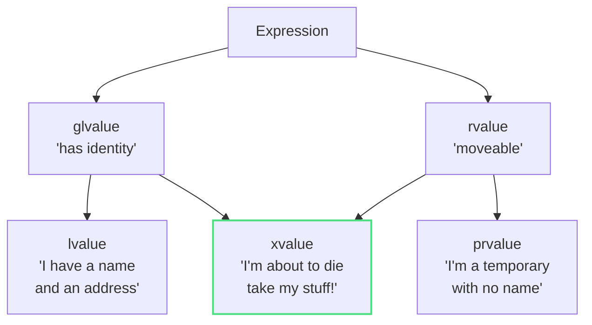
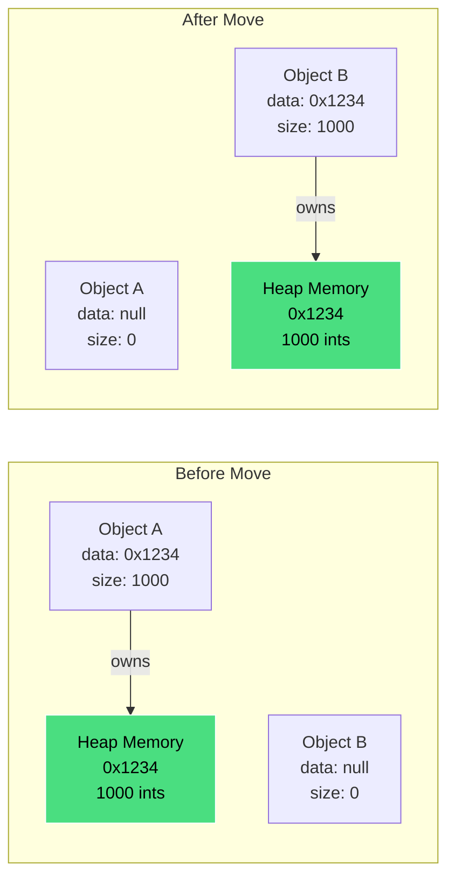

## The Problem: When "Optimization" Makes Things Slower

Let's start with something that trips up even experienced developers. You write what looks like perfectly reasonable C++ code:

```cpp
struct HeavyObject {
    std::string data;

    HeavyObject(HeavyObject&& other) : data(std::move(other.data)) {}

    HeavyObject(const HeavyObject& other) : data(other.data) {}
    
    HeavyObject(const char* s) : data(s) {}
};

std::vector<HeavyObject> createData() {
    std::vector<HeavyObject> data;
    // ... populate data ...
    return data;
}

void processData() {
    auto result = createData();
}
```

This code works. It compiles. It runs. But depending on how you've implemented your types, it might be performing thousands of expensive copy operations instead of cheap moves without you realizing it.

Here's what's happening behind the scenes: When your `std::vector` needs to grow beyond its reserved capacity, it allocates new memory and moves all elements from the old memory to the new memory. But here's the catch, if your move constructor isn't marked with the `noexcept` keyword, the compiler won't use it at all. Instead, it falls back to copying every single element.

Why? Because `std::vector` needs to maintain what's called the "strong exception guarantee." This is a fancy way of saying: if something goes wrong during reallocation, your original vector should be left completely untouched. If copies throw an exception during reallocation, no problem, the original vector is still intact. But if moves throw an exception, some elements might have already been moved, leaving your original vector in a corrupted state.

So the standard library plays it safe: if your move constructor *might* throw (because you didn't mark it `noexcept`), containers just copy everything instead. That "optimization" you thought you were getting? It's not happening.

And here's where things get interesting: `std::move` won't magically fix this problem. In fact, if you use it incorrectly, you'll make things worse. Let me show you why.

---

## The Mechanics: What is `std::move` Really?

Here's the truth that might surprise you: **`std::move` doesn't actually move anything**. Not a single byte of memory changes location when you call `std::move`. it's one of the most misleading named functions in the C++ standard library.

So what does it acctually do? Let's look at the real implementation from the standard library (this is from [libstdc++](https://gcc.gnu.org/onlinedocs/gcc-4.8.0/libstdc++/api/a01367_source.html), but other standard libraries have similar implementations):

```cpp
template<typename _Tp>
constexpr typename std::remove_reference<_Tp>::type&&
move(_Tp&& __t) noexcept
{
    return static_cast<typename std::remove_reference<_Tp>::type&&>(__t);
}
```

If you're looking at this and thinking "that's just a cast!", you're absolutely right. That's all it is. `std::move` takes whatever you pass to it, strips off any reference qualifiers (the `std::remove_reference` part), adds `&&` to make it an rvalue reference, and then performs a `static_cast` to that type, That's the entire function.

Let me put this in simpler terms: `std::move` is like putting a sign on your object "I'm done with this, you can take its stuff." The acctual taking of the stuff happens later, when some other code sees that sign. **Specifically, that 'sign' (the rvalue reference type) tells the compiler to select the Move Constructor instead of the Copy Constructor**.

### Understanding Value Categories: The Foundation Everything Builds On

Now, to really understand why `std::move` behaves this way, we need to dive into the concept of Value Categories in C++. thsi is the way to understanding not just `std::move`, but move semantics in general.

In modern C++, every expression has a Value Category, which determines how that expression can be used. Think of these categories as answering two questions about an expression:

1. Does it have an identity? (Can I take its address?)
2. Can I move from it? (Can I steal its resources?)

Based on these questions, C++ classifies expressions into several categories. We will focus on the three main ones:



Let me break these down:

- **lvalue** (left value): This is the most familiar category. An lvalue is anything that has a name and occupies a specific location in memory. You can take its address with the `&` operator. When you write:

```cpp
int x = 5;
std::string name = "Alice";
```

Both `x` and `name` are lvalues. They have names, they have addresses, they stick around beyond the current expression. You can think of them as "things with permanent addresses."

- **prvalue** (pure rvalue): This category represents temporary values that do not have a persistent identity. They are typically created during expressions and are meant to be used immediately. For example:

```cpp
42              // literal, a prvalue
5 + 3           // result of addition, a prvalue
std::string("hello")  // temporary object, a prvalue
```

These values don't have names or addresses you can take. They exist only for the duration of the expression in which they are created. They're like "things passing through."

- **xvalue** (expiring value): This is the special one, and it's what `std::move` creates. An xvalue is something that still has an identity (you can refer to it, it has a name), but we're treating it as if it's about to expire. It's like saying "this thing technically still exists, but I'm done with it, so treat it like a temporary."

When you write `std::move(name)`, you're not moving `name`. You're converting the lvalue `name` into an xvalue. You're changing how the compiler sees `name`. The actual variable `name` doesn't go anywhere. Its contents don't move. All that happens is the compiler now treats this expression as "this object is expiring, you can pillage its resources."

This is why I said `std::move` is just a cast. It changes the Value Category of the expression, not the object itself by casting from one value category to another(xvalue). The actual moving of resources happens later, when the Move Constructor or Move Assignment Operator is invoked on that xvalue.

Think of it like this: `std::move` is putting a "FREE STUFF" sign on your object. The actual taking of the stuff happens when someone who knows how to move sees that sign and acts on it.

---

## The Naive Approach: Three Mistakes That Will Hurt Your Performance

Now that we understand what `std::move` really does, let's talk about how people often misuse it, leading to worse performance instead of better.

### Mistake 1: `return std::move(local_var)`: Breaking the Compiler's Best Optimization

This is probably the single most common misuse of `std::move`. 

```cpp
std::string createString() {
    std::string result = "expensive data";
    // ... do lots of work building up result ...
    return std::move(result);  // DON'T DO THIS!
}
```

You might think:"Hey, I'm returning a local variable, so I should use `std::move` to avoid a copy!" But actually, you're making things worse. Let me explain why.

Modern C++ compilers have an optimization called NRVO (Named Return Value Optimization). Here's how it works: when you return a local variable, the compiler is allowed to construct that variable directly into the memory location where the caller expects the return value to be. This means no copy or move is needed at all. The object is constructed in place. In other words, instead of:

1. Creating `result` in the function's stack frame.
2. Copying or moving `result` to the caller's context.
3. Destroying `result` in the function's stack frame.

The compiler can optimize it to just:

1. Construct `result` directly in the caller's context.

This eliminates both the move *and* the destruction of the local object. It's better than moving, it's zero operations instead of one.

But here's the catch: NRVO has rules. For the optimization to work, the return statement must return a variable by name. When you write `return std::move(result);`, you're no longer returning `result` by name. Instead, you're returning an xvalue created by `std::move`.

SO the compiler says "Well, I can't do NRVO because this isn't just a name beig returned." Now you're stuck with a move operation. You've traded a zero-cost operation (NRVO) for one operation (move). This is called pessimization (the opposite of an optimization).

"But wait" you might say, "isn't a move cheap?" Yes, moving is usually cheaper than copying. But zero operations are cheaper than one operation. And for types where moving isn't trivial (maybe your string has a small string optimization, or other complexities), you might be forcing extra work that the compiler could have avoided entirely.

The fix is simple: just return the variable by name:

```cpp
std::string createString() {
    std::string result = "expensive data";
    // ... do lots of work ...
    return result;  // Correct - enables NRVO, or moves if NRVO can't happen
}
```

The compiler will do NRVO if it can. If it can't (maybe because of complex control flow), it will automatically treat the return as an rvalue and move for you. You don't need to do anything.

> **The rule**: Never use `std::move` on a return statement with a local variable. The compiler is smarter than you think.

### Mistake 2: `const T obj; std::move(obj)`: The Silent Copy

This one is hidden and hurts:

```cpp
void process() {
    const std::vector<int> data = getData();
    consume(std::move(data));  // Surprise: this COPIES, doesn't move!
}
```

Let me walk you through why this fails. When you mark something `const`, you're telling the compiler "this object's state won't change." But moving is fundamentally about changing state, it's about taking the resources from an object and transferring them to another. The source object's state absolutely must change (usually, it becomes empty or null).

So what happens when you try to move from a const object? Let's look at what the compiler sees:

1. `std::move(data)` returns `const std::vector<int>&&` (a const rvalue reference)
2. The move constructor signature is `vector(vector&& other)` (takes a non-const rvalue reference)
3. A `const T&&` cannot bind to a `T&&` parameter (you can't remove const in a conversion)
4. But a `const T&&` *can* bind to a `const T&` parameter (the copy constructor)
5. So the compiler uses the copy constructor instead

You wrote code that looks like it's moving, but the compiler silently falls back to copying because it can't legally move from a const object. All those expensive copies you were trying to avoid are still happening.

Here's what's really happening:

```cpp
// You write:
consume(std::move(data));

// The compiler effectively sees:
// Can't call consume(vector&&) because data is const
// Falls back to consume(const vector&)
// This calls the COPY constructor
```

This one of the most dangerous bugs because there's no warning or error. Your code compiles and runs, but it's not doing what you think it is.

> **The rule**: Never use `std::move` on const objects. If something is const, you can't move from it by definition. Moving requires modifying the source object, and const means "cannot modify."

### Mistake 3: Using the Object After Move: Playing with Fire

Here's the third common mistake:

```cpp
std::string name = "Alice";
std::string movedName = std::move(name);
std::cout << name << std::endl;  // What happens here?
```

The C++ standard says that after you move from a standard library object, it's in a "valid but unspecified state." Let me unpack what this cryptic phrase means.

"Valid" means the object still maintains its class invariants. For `std::string`, this means:

- Its internal pointers aren't dangling
- Its size is consistent with its capacity
- You can safely call its destructor
- You can call methods that don't have preconditions

"Unspecified" means you don't know what the value is. Maybe `name` is now empty. Maybe it still contains "Alice". Maybe it contains something completely different. The standard doesn't say, and implementations vary.

Here's what you can safely do with a moved-from object:

- Destroy it (it will clean up properly)
- Assign to it (`name = "Bob"` is fine)
- Call methods with no preconditions (`name.empty()`, `name.clear()`)

Here's what you should not do:

- Read its value (`std::cout << name`)
- Call methods with preconditions (`name[0]` or `name.back()` assume the string isn't empty)
- Make any assumptions about its state

In practice, most standard library implementations do leave moved-from objects in a predictable state (strings are usually empty, vectors are usually empty), but this is not guaranteed. Code that relies on this is non-portable and technically undefined behavior.

The mental model I use: treat a moved-from object as if you'd just destroyed it. It's still technically alive (so you can assign to it), but its value is gone. It's like a person who's been mind-wiped—still physically there, but everything that made them "them" is gone.

> **The rule**: After calling `std::move` on an object, don't use that object again except to assign a new value to it or destroy it. Treat it as effectively dead.

---

## Implementing Move Semantics Correctly

Now that we've covered what to not do, let's talk about doing it right. If you're implementing a class that manages resources  (memory, file handles, network connections, etc.), you need to implement move semantics. And there's a well-established pattern for doing this correctly.

### The Rule of Five

In modern C++, if you need to implement one of these special member functions, you usually need to implement all five:

1. Destructor
2. Copy Constructor
3. Copy Assignment Operator
4. Move Constructor
5. Move Assignment Operator

This is called the "Rule of Five" (it used to be the "Rule of Three" before move semantics existed). Let me show you a complete, correct implementation, and then we'll break down each piece:


```cpp
class Resource {
private:
    int* data;
    size_t size;

public:
    // Constructor
    Resource(size_t n) : data(new int[n]), size(n) {
        std::cout << "Constructing Resource with " << n << " elements\n";
    }
    
    // Destructor
    ~Resource() {
        std::cout << "Destroying Resource\n";
        delete[] data;
    }
    
    // Copy constructor: creates a deep copy
    Resource(const Resource& other) 
        : data(new int[other.size]), size(other.size) {
        std::cout << "Copy constructing Resource\n";
        std::copy(other.data, other.data + size, data);
    }
    
    // Copy assignment operator: creates a deep copy
    Resource& operator=(const Resource& other) {
        std::cout << "Copy assigning Resource\n";
        if (this != &other) {  // Protect against self-assignment
            delete[] data;
            size = other.size;
            data = new int[size];
            std::copy(other.data, other.data + size, data);
        }
        return *this;
    }
    
    // Move constructor: transfers ownership
    Resource(Resource&& other) noexcept
        : data(std::exchange(other.data, nullptr)),
          size(std::exchange(other.size, 0)) {
        std::cout << "Move constructing Resource\n";
    }
    
    // Move assignment operator: transfers ownership
    Resource& operator=(Resource&& other) noexcept {
        std::cout << "Move assigning Resource\n";
        if (this != &other) {  // Protect against self-assignment
            delete[] data;
            data = std::exchange(other.data, nullptr);
            size = std::exchange(other.size, 0);
        }
        return *this;
    }
};
```

Let me walk through each of these, because each one servers a specific purpose:

**The Constructor and Destructor** are straightforward: the constructor allocates resources, the destructor frees them. This is basic RAII (Resource Acquisition Is Initialization), the resource's lifetime is tied to the object's lifetime.

**The Copy Constructor and Copy Assignment** do exactly what you'd expect: they create a completely independent copy of the resource. If one Resource owns a chunk of memory, copying it creates a new Resource that owns a completely different chunk of memory with the same contents. Neither object affects the other after copying.

**The Move Constructor and Move Assignment** are where things get interesting. Instead of creating a new resource, they steal the resource from the source object. Let's zoom in on the move constructor:

```cpp
Resource(Resource&& other) noexcept
    : data(std::exchange(other.data, nullptr)),
      size(std::exchange(other.size, 0)) {
    std::cout << "Move constructing Resource\n";
}
```

### Understanding `std::exchange`: The Clean Way to Move

Notice that we're using `std::exchange` here. This is a utility function from `<utility>` that does two things in one operation:

1. It returns the current value of the first argument.
2. It sets the first argument to the second argument.

So `std::exchange(other.data, nullptr)` means:

- Get the current value of `other.data` (the pointer to the resource).
- Set `other.data` to `nullptr` (indicating that `other` no longer owns the resource).
- Return the original pointer value.

This is perfect for implementing moves because we're doing exactly what moving requires:

1. Taking ownership of the resource from `other`.
2. Leaving `other` in a valid, empty state (so its destructor won't free the resource we just took).

We could write this without `std::exchange`:

```cpp
Resource(Resource&& other) noexcept
    : data(other.data), size(other.size) {
    other.data = nullptr;
    other.size = 0;
}
```

But `std::exchange` is cleaner and more explicit about what's happening. It's the idiomatic way to implement moves in modern C++.

Here's what's happening visually:



The memory itself doesn't move. The pointers swap. Object B takes ownership of the heap memory, and Object A is left in a safe empty state.

### The Critical Importance of `noexcept`

Now let's talk about why both move operations are marked `noexcept`. This keyword is not optional, it's absolutely critical for performance.

Remember earlier when I mentioned that `std::vector` won't use your move constructor during reallocation unless it's `noexcept`? Here's why:

When `std::vector` grows, it needs to maintain the strong exception guarantee. This means if something goes wrong during reallocation, the original vector must remain completely unchanged. Let's think through the scenarios:

#### Scenario 1: Using copy constructors

- Create new memory block
- Copy element 1 to new memory (might throw)
- If it throws, delete new memory, original vector is untouched
- Copy element 2 to new memory (might throw)
- If it throws, destroy element 1 in new memory, delete new memory, original is untouched
- Continue...

No matter when an exception is thrown, we can clean up and the original vector is fine.

#### Scenario 2: Using move constructors that may throw

- Create new memory block
- Move element 1 to new memory (might throw)
- If it throws, element 1 is now in an unspecified state
- Move element 2 to new memory (might throw)
- If it throws, element 1 was already moved (possibly corrupted), element 2 is now corrupted
- We cannot restore the original state!

If moves can throw, we can't guarantee the original vector remains valid if an exception occurs during reallocation. So `std::vector` makes a choice: if your move constructor might throw (not marked `noexcept`), it uses copies instead to maintain the guarantee.

The practical impact: if you forget `noexcept` on your move constructor, every time your vector grows, it will copy all elements instead of moving them. For a vector of complex objects, this could mean millions of unnecessary allocations.

> **The rule**: Always, always, always mark move constructors and move assignment operators `noexcept` unless you have an exceptional reason not to (and you almost never do).

---

## std::move vs std::forward: Two Tools for Different Jobs

Now that you understand `std::move`, let's briefly distinguish it from its cousin, `std::forward`. These are both cast functions that deal with value categories, but they serve different purposes.

**`std::move`** is unconditional. It always converts its argument to an rvalue reference, regardless of what you pass in:

```cpp
template<typename T>
void process(T&& arg) {
    // arg is an lvalue here (it has a name!)
    consume(std::move(arg));  // Always passes an rvalue to consume
}
```

Even though `arg` has `&&` in its type, once it has a name, it's an lvalue. That's the rule: if it has a name, it's an lvalue. So inside `process`, `arg` is an lvalue, and we use `std::move` to convert it back to an rvalue for consumption.

**`std::forward`** is conditional. It preserves the value category of its argument. This is used for perfect forwarding in templates:

```cpp
template<typename T>
void wrapper(T&& arg) {
    // If arg was originally an lvalue, pass it as an lvalue
    // If arg was originally an rvalue, pass it as an rvalue
    process(std::forward<T>(arg));
}
```

The key difference is that `std::forward` remembers what `arg` was when it was passed to `wrapper`, and maintains that. If you called `wrapper(x)` with an lvalue `x`, `std::forward<T>(arg)` produces an lvalue. If you called `wrapper(std::move(x))` with an rvalue, `std::forward<T>(arg)` produces an rvalue.


Here's when to use each:

- **Use `std::move`** when you know you want to move from something, and you're done with it
- **Use `std::forward`** only in template functions with forwarding reference (`T&&` where `T` is a template parameter), when you want to pass arguments along while preserving whether they were lvalues or rvalues

In 99% of normal code, you'll use `std::move`. `std::forward` is mainly for library authors and framework code that's trying to wrap other functions perfectly.

---

## Modern C++ Context: How Move Semantics Have Evolved

Move semantics were introduced in C++11, but they've continued to evolve in subsequent standards. Let's look at some key developments that affect how you write modern C++.

### C++14: `constexpr` Move

In C++11, std::move was a runtime-only operation. C++14 changed this by marking std::move as constexpr.

This might seem like a small detail, after all, std::move is just a cast—but it was the first step toward enabling complex move-heavy logic (like sorting or swapping) to happen entirely at compile time.

### C++17: Mandatory Copy Elision

Before C++17, copy elision (including RVO and NRVO) was an allowed optimization, but not required. The compiler could do it, but didn't have to. This changed in C++17.

When you return a prvalue (a pure temporary), the compiler is now required to construct the object directly in the caller's slot:

```cpp
std::string create() {
    return std::string("hello");  // Guaranteed no copy/move since C++17
}
```

The object is constructed directly in the caller's memory. Always. This isn't an optimization that might happen, it's required by the standard.

This is different from NRVO (Named Return Value Optimization), which is still optional. When you return a local variable with a name:

```cpp
std::string create() {
    std::string result = "hello";
    return result;  // NRVO still optional, but compilers usually do it
}
```

The compiler is allowed to construct `result` directly in the caller's memory, but it's not required to. In practice, modern compilers do this optimization reliably, but it's technically not guaranteed by the standard.

The takeaway: returning temporaries is guaranteed efficient in C++17 and later. Don't try to "optimize" with `std::move`.

### C++20: Moving "Heap" Memory at Compile Time

This is where things get wild. While `std::move` was `constexpr` since C++14, you couldn't actually do much with it regarding standard containers because you couldn't allocate memory at compile time.

C++20 introduced `constexpr` **dynamic allocation**. This means `std::vector` and `std::string` can now be used (and moved!) inside constexpr functions.

```cpp
constexpr int sum_data() {
    std::vector<int> data = {1, 2, 3};
    std::vector<int> moved_data = std::move(data); // Valid in C++20!
    
    int sum = 0;
    for(int i : moved_data) sum += i;
    return sum;
}

// The vector is created, moved, and destroyed entirely at compile time
constexpr int result = sum_data();
```

This enables more sophisticated compile-time programming. You can now write constexpr functions that move objects around, and the entire computation happens at compile time.

### C++23: Move-Only Function Wrapper

C++23 introduced `std::move_only_function`, which is like `std::function` but can hold non-copyable types:

```cpp
// Before C++23, this didn't work because std::function requires copyability:
// std::function<void()> func = [ptr = std::make_unique<int>(42)]() {
//     std::cout << *ptr;
// };  // Error: unique_ptr is not copyable!

// C++23 solution:
std::move_only_function<void()> func = [ptr = std::make_unique<int>(42)]() {
    std::cout << *ptr;
};  // Works! func can only be moved, not copied
```

This is particularly useful for callbacks and handlers that need to own unique resources.

### The Future: Trivial Relocation (Still in Development)

There's an ongoing standardization effort around "trivial relocation" that's worth knowing about, even though it's not standardized yet. The basic idea is that for many types, moving an object is equivalent to just copying its bytes and forgetting about the original.

Consider what happens today when a `std::vector<std::string>` needs to grow (reallocate)

1. For each string, call the move constructor (copies the pointer, nulls the old pointer)
2. For each string in the old memory, call the destructor (checks if pointer is null, does nothing)

That's lot of function calls. But conceptually, we could just:

1. `memcpy` the entire block of strings to new memory
2. Forget about the old memory (no destructors needed, they're all null anyway)

This is called "trivial relocation", the type can be relocated via a simple byte copy.

Two proposals are competing for this feature:

- **P1144** (by Arthur O'Dwyer): Aligns with how libraries like Folly, BDE, and Qt already implement this
- **P2786** (by Giuseppe D'Angelo and others): Was merged into the Working Draft at the Hagenberg 2024 meeting, but remains controversial

The controversy stems from differences in semantics and interface. P2786 was merged despite concerns from implementers that its semantics don't match existing practice. Many major library maintainers prefer P1144's design.

Why does this matter to you? If/when trivial relocation is standardized, operations like vector reallocation could become dramatically faster for suitable types—potentially orders of magnitude faster for large containers. But the exact details of how to opt in and what guarantees you get are still being decided.

---
