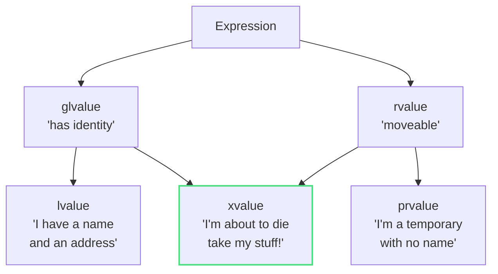

## The Problem: When "Optimization" Makes Things Slower

Let's start with something that trips up even experienced developers. You write what looks like perfectly reasonable C++ code:

```cpp
struct HeavyObject {
    std::string data;

    HeavyObject(HeavyObject&& other) : data(std::move(other.data)) {}

    HeavyObject(const HeavyObject& other) : data(other.data) {}
    
    HeavyObject(const char* s) : data(s) {}
};

std::vector<HeavyObject> createData() {
    std::vector<HeavyObject> data;
    // ... populate data ...
    return data;
}

void processData() {
    auto result = createData();
}
```

This code works. It compiles. It runs. But depending on how you've implemented your types, it might be performing thousands of expensive copy operations instead of cheap moves without you realizing it.

Here's what's happening behind the scenes: When your `std::vector` needs to grow beyond its reserved capacity, it allocates new memory and moves all elements from the old memory to the new memory. But here's the catch, if your move constructor isn't marked with the `noexcept` keyword, the compiler won't use it at all. Instead, it falls back to copying every single element.

Why? Because `std::vector` needs to maintain what's called the "strong exception guarantee." This is a fancy way of saying: if something goes wrong during reallocation, your original vector should be left completely untouched. If copies throw an exception during reallocation, no problem, the original vector is still intact. But if moves throw an exception, some elements might have already been moved, leaving your original vector in a corrupted state.

So the standard library plays it safe: if your move constructor *might* throw (because you didn't mark it `noexcept`), containers just copy everything instead. That "optimization" you thought you were getting? It's not happening.

And here's where things get interesting: `std::move` won't magically fix this problem. In fact, if you use it incorrectly, you'll make things worse. Let me show you why.

---

## The Mechanics: What is `std::move` Really?

Here's the truth that might surprise you: **`std::move` doesn't actually move anything**. Not a single byte of memory changes location when you call `std::move`. it's one of the most misleading named functions in the C++ standard library.

So what does it acctually do? Let's look at the real implementation from the standard library (this is from [libstdc++](https://gcc.gnu.org/onlinedocs/gcc-4.8.0/libstdc++/api/a01367_source.html), but other standard libraries have similar implementations):

```cpp
template<typename _Tp>
constexpr typename std::remove_reference<_Tp>::type&&
move(_Tp&& __t) noexcept
{
    return static_cast<typename std::remove_reference<_Tp>::type&&>(__t);
}
```

If you're looking at this and thinking "that's just a cast!", you're absolutely right. That's all it is. `std::move` takes whatever you pass to it, strips off any reference qualifiers (the `std::remove_reference` part), adds `&&` to make it an rvalue reference, and then performs a `static_cast` to that type, That's the entire function.

Let me put this in simpler terms: `std::move` is like putting a sign on your object "I'm done with this, you can take its stuff." The acctual taking of the stuff happens later, when some other code sees that sign. **Specifically, that 'sign' (the rvalue reference type) tells the compiler to select the Move Constructor instead of the Copy Constructor**.

### Understanding Value Categories: The Foundation Everything Builds On

Now, to really understand why `std::move` behaves this way, we need to dive into the concept of Value Categories in C++. thsi is the way to understanding not just `std::move`, but move semantics in general.

In modern C++, every expression has a Value Category, which determines how that expression can be used. Think of these categories as answering two questions about an expression:

1. Does it have an identity? (Can I take its address?)
2. Can I move from it? (Can I steal its resources?)

Based on these questions, C++ classifies expressions into several categories. We will focus on the three main ones:



Let me break these down:

- **lvalue** (left value): This is the most familiar category. An lvalue is anything that has a name and occupies a specific location in memory. You can take its address with the `&` operator. When you write:

```cpp
int x = 5;
std::string name = "Alice";
```

Both `x` and `name` are lvalues. They have names, they have addresses, they stick around beyond the current expression. You can think of them as "things with permanent addresses."

- **prvalue** (pure rvalue): This category represents temporary values that do not have a persistent identity. They are typically created during expressions and are meant to be used immediately. For example:

```cpp
42              // literal, a prvalue
5 + 3           // result of addition, a prvalue
std::string("hello")  // temporary object, a prvalue
```

These values don't have names or addresses you can take. They exist only for the duration of the expression in which they are created. They're like "things passing through."

- **xvalue** (expiring value): This is the special one, and it's what `std::move` creates. An xvalue is something that still has an identity (you can refer to it, it has a name), but we're treating it as if it's about to expire. It's like saying "this thing technically still exists, but I'm done with it, so treat it like a temporary."

When you write `std::move(name)`, you're not moving `name`. You're converting the lvalue `name` into an xvalue. You're changing how the compiler sees `name`. The actual variable `name` doesn't go anywhere. Its contents don't move. All that happens is the compiler now treats this expression as "this object is expiring, you can pillage its resources."

This is why I said `std::move` is just a cast. It changes the Value Category of the expression, not the object itself by casting from one value category to another(xvalue). The actual moving of resources happens later, when the Move Constructor or Move Assignment Operator is invoked on that xvalue.

Think of it like this: `std::move` is putting a "FREE STUFF" sign on your object. The actual taking of the stuff happens when someone who knows how to move sees that sign and acts on it.

---

## The Naive Approach: Three Mistakes That Will Hurt Your Performance

Now that we understand what `std::move` really does, let's talk about how people often misuse it, leading to worse performance instead of better.

### Mistake 1: `return std::move(local_var)`: Breaking the Compiler's Best Optimization

This is probably the single most common misuse of `std::move`. 

```cpp
std::string createString() {
    std::string result = "expensive data";
    // ... do lots of work building up result ...
    return std::move(result);  // DON'T DO THIS!
}
```

You might think:"Hey, I'm returning a local variable, so I should use `std::move` to avoid a copy!" But actually, you're making things worse. Let me explain why.

Modern C++ compilers have an optimization called NRVO (Named Return Value Optimization). Here's how it works: when you return a local variable, the compiler is allowed to construct that variable directly into the memory location where the caller expects the return value to be. This means no copy or move is needed at all. The object is constructed in place. In other words, instead of:

1. Creating `result` in the function's stack frame.
2. Copying or moving `result` to the caller's context.
3. Destroying `result` in the function's stack frame.

The compiler can optimize it to just:

1. Construct `result` directly in the caller's context.

This eliminates both the move *and* the destruction of the local object. It's better than moving, it's zero operations instead of one.

But here's the catch: NRVO has rules. For the optimization to work, the return statement must return a variable by name. When you write `return std::move(result);`, you're no longer returning `result` by name. Instead, you're returning an xvalue created by `std::move`.

SO the compiler says "Well, I can't do NRVO because this isn't just a name beig returned." Now you're stuck with a move operation. You've traded a zero-cost operation (NRVO) for one operation (move). This is called pessimization (the opposite of an optimization).

"But wait" you might say, "isn't a move cheap?" Yes, moving is usually cheaper than copying. But zero operations are cheaper than one operation. And for types where moving isn't trivial (maybe your string has a small string optimization, or other complexities), you might be forcing extra work that the compiler could have avoided entirely.

The fix is simple: just return the variable by name:

```cpp
std::string createString() {
    std::string result = "expensive data";
    // ... do lots of work ...
    return result;  // Correct - enables NRVO, or moves if NRVO can't happen
}
```

The compiler will do NRVO if it can. If it can't (maybe because of complex control flow), it will automatically treat the return as an rvalue and move for you. You don't need to do anything.

**The rule**: Never use `std::move` on a return statement with a local variable. The compiler is smarter than you think.

### Mistake 2: `const T obj; std::move(obj)`: The Silent Copy

This one is hidden and hurts:

```cpp
void process() {
    const std::vector<int> data = getData();
    consume(std::move(data));  // Surprise: this COPIES, doesn't move!
}
```

Let me walk you through why this fails. When you mark something `const`, you're telling the compiler "this object's state won't change." But moving is fundamentally about changing state, it's about taking the resources from an object and transferring them to another. The source object's state absolutely must change (usually, it becomes empty or null).

So what happens when you try to move from a const object? Let's look at what the compiler sees:

1. `std::move(data)` returns `const std::vector<int>&&` (a const rvalue reference)
2. The move constructor signature is `vector(vector&& other)` (takes a non-const rvalue reference)
3. A `const T&&` cannot bind to a `T&&` parameter (you can't remove const in a conversion)
4. But a `const T&&` *can* bind to a `const T&` parameter (the copy constructor)
5. So the compiler uses the copy constructor instead

You wrote code that looks like it's moving, but the compiler silently falls back to copying because it can't legally move from a const object. All those expensive copies you were trying to avoid are still happening.

Here's what's really happening:

```cpp
// You write:
consume(std::move(data));

// The compiler effectively sees:
// Can't call consume(vector&&) because data is const
// Falls back to consume(const vector&)
// This calls the COPY constructor
```

This one of the most dangerous bugs because there's no warning or error. Your code compiles and runs, but it's not doing what you think it is.

**The rule**: Never use `std::move` on const objects. If something is const, you can't move from it by definition. Moving requires modifying the source object, and const means "cannot modify."
